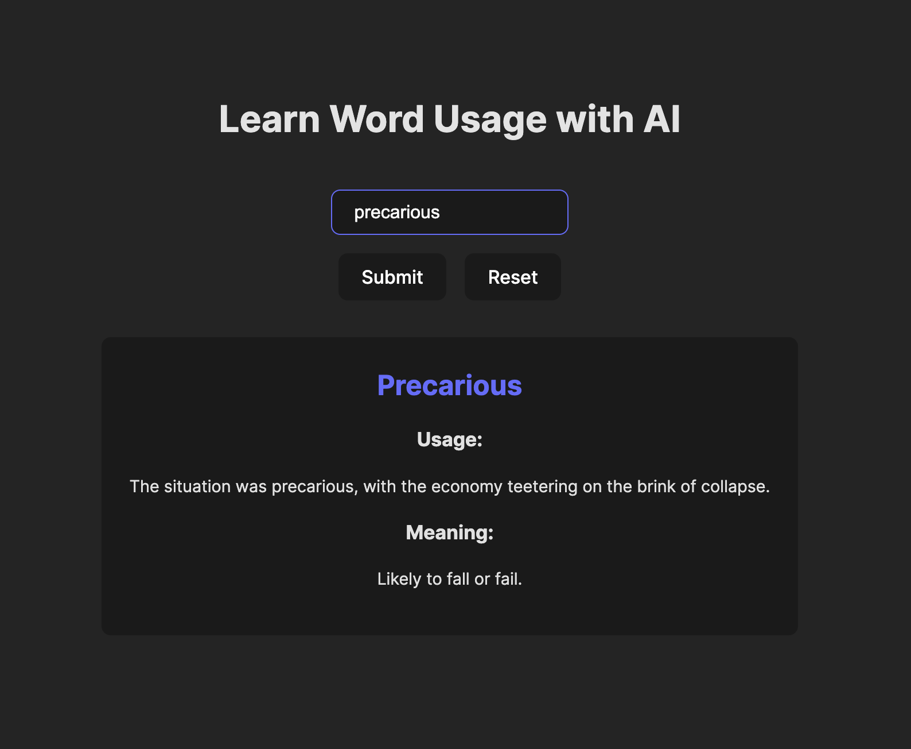

## Learn Words Using AI
>[!WARNING]
> This is just a PoC. Not ready for production use.

A proof of concept app using the on-device AI model on chrome for inferences.

>[!NOTE]
> Requires enabling the experimental `Prompt API for Gemini Nano` flag in chrome://flags

### Steps to run locally
1. Install dependencies: `npm install`
2. Run in dev mode: `npm run dev`
